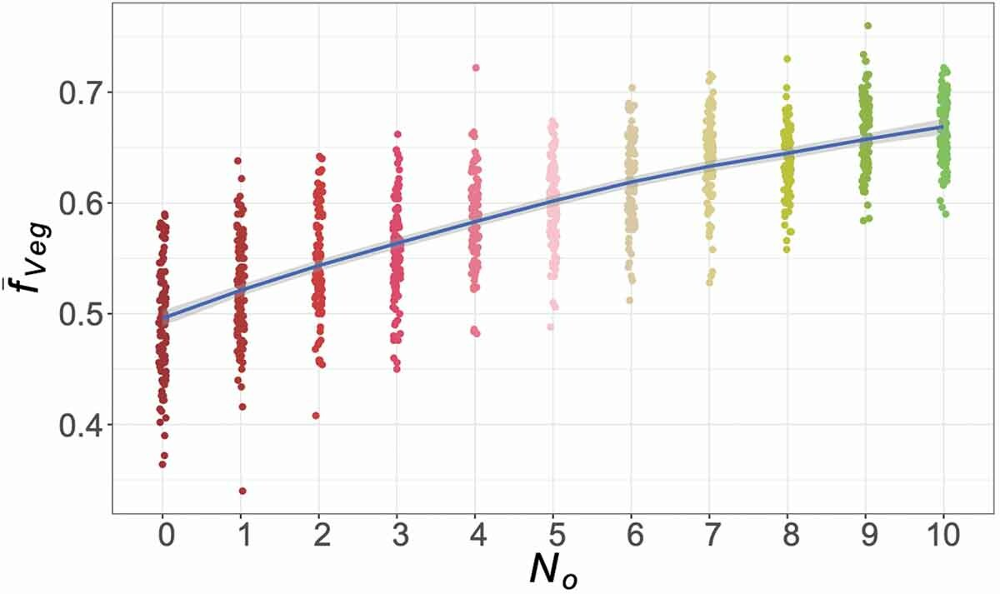

**Opinions are invisible**: we cannot directly read others' opinions but can only infer their opinions from their actions (including language). In this project, we propose an "action-opinion inference (AOI) model" that follows three principles:
* Actions are governed by underlying opinions.
* An agent infers her neighbors' opinions by their actions.
* An agent changes her opinions according to the inferred opinion distribution in her neighborhood.  

The AOI model shows that opinion dynamics are determined by the action-opinion relations: if an opinion obliges one and only one action and forbids all other actions, then the AOI model is the same as the Ising model. If an opinion permits more than one action, then the two actions form a "symbiotic" relation since the observer (i.e., the other agent) cannot tell which opinion drives the action.

The model has been published in JASSS. Read the paper [here](https://www.jasss.org/22/3/2.html).

We did not stop exploring the action-opinion inference process here. In a follow-up study, we introduced the concept of **obfuscation**: the strategy to minimize one's disclosed information while being honest. The core idea is that under the AOI framework, to obfuscate (for the purpose of privacy protection), one shall always choose the action that is:
* allowed by her opinion,
* has the largest entropy.

For example, when dining in a restaurant, choosing a beef steak has the lowest entropy since it directly indicates that you are an omnivore, while choosing a (vegan) salad has the highest entropy since both vegetarians and omnivores may eat salad. To hide the fact that you are an omnivore, you should always choose salad over steak. 

Suppose that an observer's diet opinion (i.e., vegetarian vs. omnivore) is purely determined by peer influence (i.e., if she thinks more people around her are vegetarian, she will also become vegetarian). We found that the number of obfuscators (No) has a huge impact on the share of vegetarians ($\bar{f}_{veg}$) in the population.

    

        <figure>
            
            <figcaption class="caption">
                The battle between vegetarians and omnivores: fraction of vegetarians versus the number of obfuscators (the Figure comes from <a href="https://www.tandfonline.com/doi/figure/10.1080/0022250X.2021.1929968" target="_blank">here</a>).
            </figcaption>
        </figure>
    

The paper is published in the Journal of Mathematical Sociology. Check the paper [here](https://doi.org/10.1080/0022250X.2021.1929968).

In both papers, we have provided a mathematical derivation alongside the simulation. Remember to have a look!

This project is supported by the European Research Council as part of the Consolidator Grant **BEHAVE**. I am very fortunate to work with [Prof. Caspar Chorus](https://www.tudelft.nl/io/over-io/personen/chorus-c-g) (TU Delft) and [Dr. Amineh Ghorbani](https://www.tudelft.nl/staff/a.ghorbani/) (TU Delft) on this project.